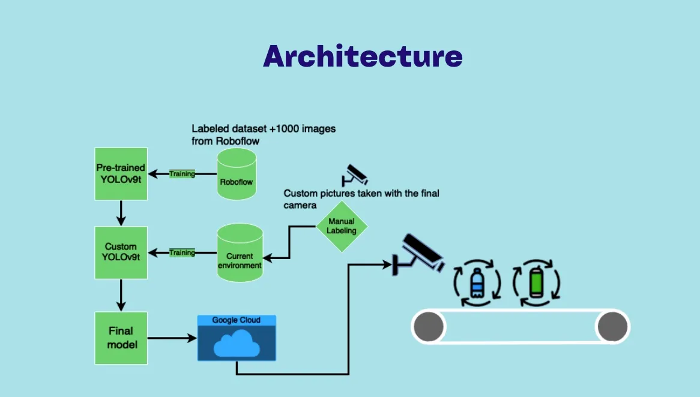
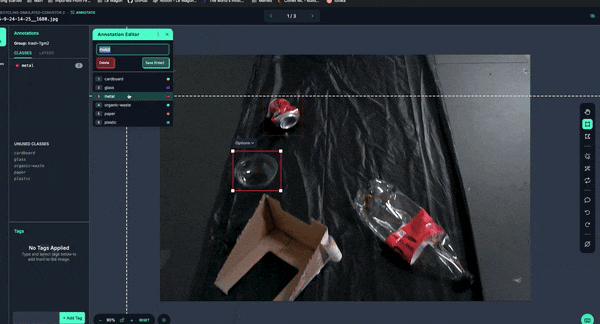

<div align="center">

# Recycling Reimagined ♻️

</div>

---

This project focuses on using image recogonition techinques to identify different types of waste products, helping imporve recycling processes. We utilized the YOLOv9 model for object detection and created a front-end interface using Streamlit to allow live recognition using a web camera.

## About
You can find here the link to the recorded presentation

https://projects.lewagon.com/projects/recycling-reimagined


<br>
Architecture
<br>
<br>
<br>

<br>
Facility representation setup
<br>
<br>
<br>

<br>
Manual labeling demo
<br>
<br>
<br>

## Features:
+ Waste product image recognition using **YOLOv9**
+ Training with both a sourced dataset and custom images.
+ Live object detection thorugh web camera on a **Streamlit-based** website.
+Deployed using Docker on the cloud.

## Dataset:
+ We used a dataset sourced from Roboflow, which contained approximately 7000 images of various waste products, notably cardboard, glass, metal, paper and plastic.
**Source**: https://universe.roboflow.com/image-processing-home-assignment/trash-detection-kfzaq

+ **Custom Additions**: WE manually annotated 100 custom images using Roboflow to further improve the model's recognition capabilites.
+ **Annotation Tool** : Annotation was done using Roboflow.


## Model:
We used the latest YOLOv9 model for object detection due to it's high efficiency and accuracy. Our process involved:

1. Training on sourced images from Roboflow.
**Source**: https://universe.roboflow.com/image-processing-home-assignment/trash-detection-kfzaq
2. Updating the model with our custom images to further refine and improve detection accuracy.

## Web Interface:
+ The front end was built using Streamlit to enable an interactive and user-friendly interface.
+ **Live Recognition**: A webcam setup was integrated into the website to allow users to perform live recognition of waste products.

## Deployement:
+ The entire application was containerized using Docker, ensuring ease of deployement.
+ The project was then hosted on the cloud, making it accessible for live demonstrations and testing.


## How to use:
### Installation:
1. Clone the repository:
```
git clone https://github.com/MiyuNori18/Recycling_Reimagined.git
```
2. Install the dependencies:

```
pip install -r requirements.txt
```

### Running the Application:
1. Run the YOLOv9 model for waste product recognition:
```
python main.py
 ```
2. Start the streamlit interface
```
streamlit run app.py
```

3. Access the live recognition feature through the webcam interface and activate your webcam for real-time detection.


## Contributors:
+ Anton Wenemoser
+ Miyuki Niyungeko
